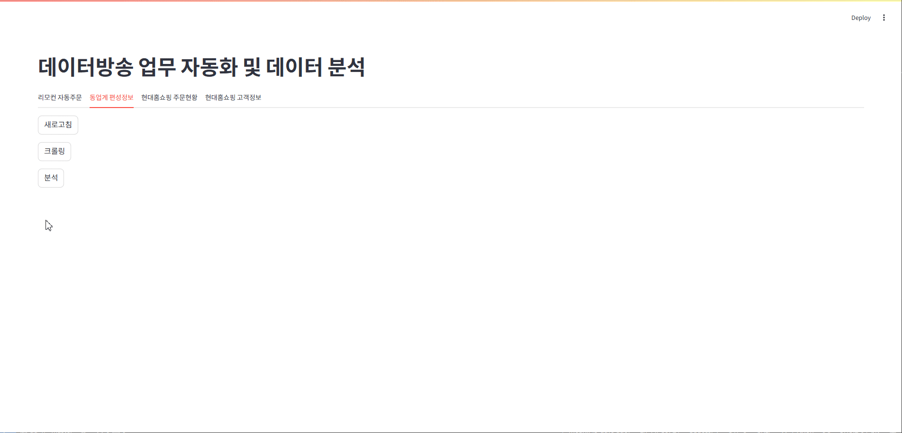

### 🎯 프로젝트 목적
데이터 역량 강화를 위한 개인 프로젝트로 Streamlit App 구축

<br>
 
### 🛠 주요 기능
✅ 1. **데이터방송 리모컨 주문 자동화**  
   - Selenium + Headless Chrome 기반 리모컨 주문 플로우 자동화


<br>

✅ 2. **동업계 편성정보 현황 크롤링 및 분석 대시보드 구현**  
   - BeautifulSoup + Selenium 을 통한 동업계 현황 크롤링 (라방바)  
   - 방송유형(라이브/데이터)과 채널별 편성 패턴 분석  
   - 일자, 시간대별 상품 편성 집중도 시각화  
   - 상품유형별 방송 횟수 및 트렌드 파악


<br>


<br>

✅ 3. **주문현황 분석 및 대시보드 구현**  
   - 기간, 일자별 주문현황  
   - 접수채널, 결제수단별 분석


<br>

✅ 4. **주문고객 클러스터링 및 주문예측 구현**  
   - RFM 분석 및 KMeans 고객 클러스터링  
   - 클러스터별 고객 특성 분석  
   - 분류 알고리즘 통한 주문 예측 (RandomForest, XGBoost, LightGBM)  
   - 클러스터별 예측 성능 분석을 통한 마케팅 전략 수립


<br>

<br>
 
### 🧾 프로젝트 구조
```
da/
├── bfmt_ord                                                  # 편성주문정보
├── broad_info                                                # 동업계 편성정보 일자별 크롤링 파일 
├── file                                                      # 데이터 파일 (동업계 편성정보, 편성 주문정보, 주문고객 정보)
├── gif                                                       # 시연 영상
├── img                                                       # 고객 클러스터 주문예측 비교 결과
├── src                              
     ├── automaticOrder.py                                    # 데이터방송 리모컨 자동 주문
     ├── crawlBroadcast.py                                    # 동업계 편성정보 크롤링
     ├── analyzeBroadcast.py                                  # 동업계 편성현황 분석
     ├── analyzeOrderHd.py                                    # 편성주문현황 분석
     ├── analyzeCustHd.py                                     # 주문고객 클러스터링 
     ├── predictOrderCustHd.py                                # 클러스터링 주문 예측 
├── .gitattributes
├── app.py                                                     # Streamlit 메인  
├── packages.txt
├── requirements.txt
```


